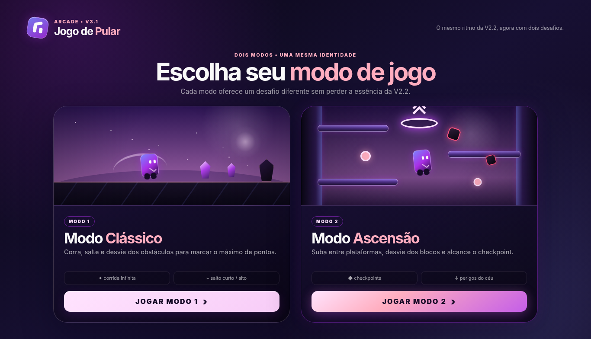
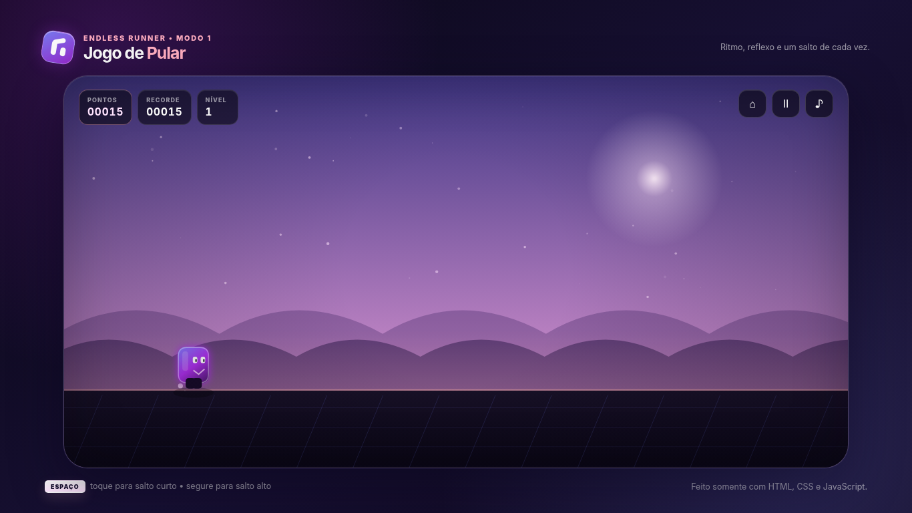
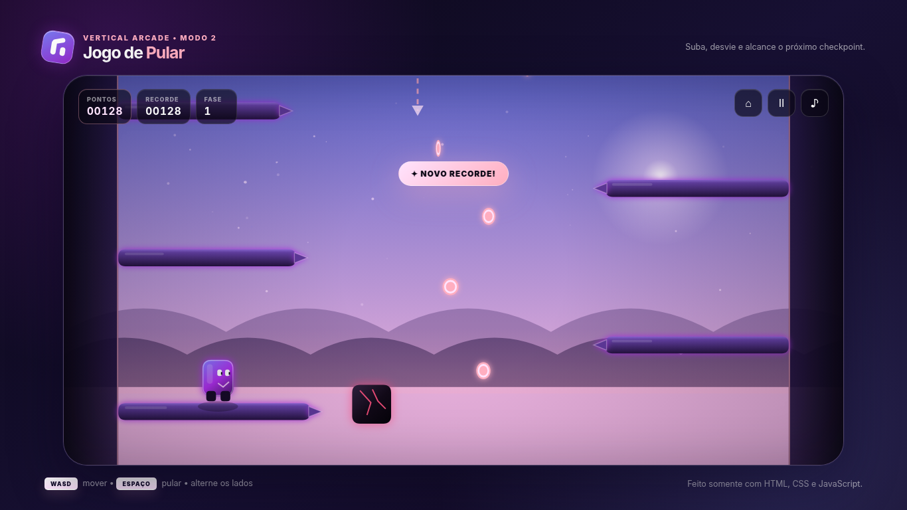
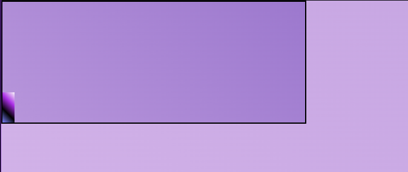

# Jogo de Pular — V4.0 Universal Mobile Compatibility

A lightweight arcade game built with **HTML, CSS and Vanilla JavaScript**, now featuring two distinct game modes while preserving the visual identity, animated character, and movement style established in the V2.2 version.

Version **V4.0** fixes mobile-browser detection and orientation handling, including Samsung Galaxy A54-style portrait layouts. It retains V3.9 game mechanics, the responsive joystick, readable HUD and V2.2 character design. The game remains static and compatible with GitHub Pages.

---

## What Changed in V4.0

- **Samsung Galaxy A54 / mobile browser fix:** handheld detection no longer requires reliable `maxTouchPoints`, `pointer: coarse`, or `hover: none` values at the same time; Android/Samsung Browser and iPhone browser hints provide a fallback.
- **Portrait orientation gate:** phones held vertically display the existing animated **Jogue na horizontal** screen instead of shrinking the desktop game into portrait.
- **Landscape unlock:** when physically rotated, the game automatically reveals the mode selection or resumes the paused game; the fullscreen/landscape lock is still attempted after user interaction where supported.
- **Layout sizing:** fixed-size world rendering scales to the mobile viewport and respects safe areas and dynamic browser chrome.
- **No gameplay redesign:** Classic Mode physics, Ascension zigzag platforms, joystick, HUD and character animations remain unchanged.
- **Regression test coverage:** portrait/landscape desktop, Android phone (including altered touch reporting) and compact landscape layouts.

**Browser limitation:** regular websites cannot guarantee forced device rotation on page load. When orientation locking is blocked, turn the device sideways as guided by the animated screen.

---

## What Changed in V3.9

- **Mobile Ascension start fix:** the start panel no longer blocks the on-screen jump arrow; a dedicated start button is also available inside the panel.
- **Safer overlay stacking:** pause and Game Over stay above the gameplay controls, avoiding accidental actions.
- **Mobile menu margins:** more breathing room around the headline and eyebrow text, including compact landscape devices and safe areas.
- **Touch controls sync:** joystick and jump-button visibility updates immediately after mode selection.

## Preserved From V3.8

- **Escape shortcut (desktop):** press `Esc` while playing to pause and open the **Return to menu?** confirmation. The run is only ended after choosing **Return to modes**. Press `Esc` again or **Continue** to cancel and resume.
- **Unified menu logic:** the HUD menu icon and Escape use the same confirmation logic, preventing accidental loss of a run.
- **Redesigned HUD:** clear custom SVG icons for **MODOS**, **PAUSA / SEGUIR**, and **SOM / MUDO**, with readable labels on desktop and mobile.
- **Mobile improvements:** larger tap targets, stronger contrast, legible score/level cards and a compact confirmation dialog that fits landscape phones.
- **Better confirmation text and button emphasis:** clear distinction between **Continue** and **Return to modes** without changing game physics, character animations, power-ups or game modes.
- **GitHub Pages friendly:** the static `index.html`, `README.md` and `assets/` structure is unchanged.

---

## What Changed in V3.7

- **Fixed character flattening on mobile:** analog joystick values are no longer used as the sprite's horizontal scale. Left/right facing is always a full-width mirror, keeping the original V2.2 character and leg animation readable.
- **Faster joystick response:** a short drag (roughly 16–22 CSS pixels, depending on the joystick size) can reach full horizontal input without having to push all the way to the edge.
- **Better directional changes:** slightly stronger ground/air acceleration and braking help the player steer between Ascension platforms.
- **Fewer accidental falls:** vertical/drop input requires a predominantly vertical joystick gesture rather than an ordinary diagonal steering gesture.
- **Arrow-only jump button:** a large, clear upward arrow replaces the visible JUMP text, while the button keeps an accessible label for screen readers.
- Original visuals, Classic Mode controls, checkpoints, scores, power-ups, mobile landscape support, folder structure, and GitHub Pages compatibility are preserved.

---

## Screenshots

### Mode Selection Menu



### Classic Mode



### Ascension Mode



### First Version



---

## Project Evolution

The project started as a very simple jumping-game prototype inspired by endless runners.

Over time, it evolved into a more complete responsive arcade game with:

- an animated character;
- progressive difficulty;
- power-ups;
- persistent high scores;
- a dedicated mobile landscape experience;
- a game-mode selection menu;
- the original **Classic Mode**;
- the new **Ascension Mode**;
- responsive desktop, tablet and mobile layouts;
- touch-based gameplay controls.

The main goal of the recent versions has been to expand the game **without losing the visual identity and movement style of V2.2**.

---

## What's New in V3.6

### Virtual Joystick and Jump Button

The full-screen dragging interface was replaced by a stable virtual joystick. It uses pointer capture and a GPU-friendly `translate3d` animation for the thumb, rather than recalculating the entire touch overlay for every pointer movement.

- **Ascension Mode:** use the left joystick to move in any direction and the right **JUMP** button to jump. Both controls can be held simultaneously.
- **Classic Mode:** use the right jump button, or tap the gameplay area. Holding supports a higher jump.
- **Desktop:** `WASD`, arrow keys, and `Space` remain unchanged.
- Joystick input returns to neutral when released or cancelled.

### Performance and Landscape Experience

- Mobile canvas rendering is capped at a `1×` internal pixel ratio, reducing GPU fill and memory usage while retaining the original logical game coordinates.
- Reduced mobile particle density and removed expensive blur layers from the active game view.
- Removed frequent visual touch-feedback repositioning and redundant canvas-gradient regeneration on unchanged resize dimensions.
- Adaptive rendering drops to 30 FPS only after repeated heavy frames while gameplay physics retains a fixed 60 Hz step.
- On supported browsers/PWAs, the game requests landscape automatically when possible. A normal browser may **require a user interaction and fullscreen** before orientation lock is allowed; if blocked, the existing animated rotate-phone screen guides manual rotation.

Actual performance depends on the device and browser. The Redmi Note 13 is a target layout, but this update does not claim physical-device benchmarking.

---

## Game Flow

```text
Open the game
   ↓
Mobile in portrait?
   ├── Yes → Orientation Gate → rotate to landscape
   └── No
   ↓
Mode Selection Menu
   ├── Mode 1 — Classic
   └── Mode 2 — Ascension
```

On desktop, the mode-selection menu opens directly.

On mobile, portrait orientation shows the animated orientation screen first. Once the device enters landscape mode, the game menu becomes available.

---

# Mode 1 — Classic

Classic Mode preserves the gameplay and visual identity of V2.2 instead of rebuilding it from scratch.

## Preserved from V2.2

- original purple character;
- animated legs while running;
- landing and jumping reactions;
- purple / pink atmospheric background;
- stars, glow, moonlight and layered hills;
- original ground style;
- HUD;
- short-jump / high-jump physics;
- procedural obstacle generation;
- collectibles;
- shield power-up;
- slow-motion power-up;
- double-score power-up;
- increasing game speed;
- persistent high score;
- Web Audio effects;
- mobile touch support.

The main additions are integration with the new mode-selection menu and the ability to return to the menu.

---

# Mode 2 — Ascension

Ascension Mode uses the **same character and visual identity as V2.2**, but places the player inside a vertical arcade challenge.

## Objective

Climb by jumping between platforms attached to the **left and right sides of the arena**, avoid falling hazards, collect items, and reach the checkpoint.

Each completed checkpoint starts a harder phase.

The goal is to survive as long as possible and achieve the highest score.

---

## Ascension Gameplay

The route is intentionally designed as a **left ↔ right zigzag climb**.

The player cannot progress simply by jumping vertically in the same place.

Only landing on the next valid platform in the expected sequence advances the climb.

### Platform Rules

- platforms are anchored to the left or right side of the arena;
- the expected route alternates sides;
- future platforms cannot be used as vertical shortcuts before their turn;
- previously completed platforms remain available as recovery points;
- platform width and spacing are calibrated so jumps remain possible while still requiring precision;
- checkpoint progress depends on completing the correct platform sequence.

---

## Desktop Controls

### Classic Mode

| Input | Action |
|---|---|
| `Space` | Start / jump / restart |
| `Esc` | Pause and confirm returning to the mode menu |
| Quick press | Short jump |
| Hold | Higher jump |

### Ascension Mode

| Input | Action |
|---|---|
| `W` | Small upward adjustment during the jump |
| `A` | Move left |
| `S` | Fast fall / drop from a platform |
| `D` | Move right |
| `Space` | Jump |
| Arrow keys | Alternative directional controls |
| `Esc` | Pause and confirm returning to the mode menu |

`A` and `D` control movement both on platforms and in the air.

The character also changes facing direction and leg animation according to movement, avoiding the previous "moonwalk" effect.

The game no longer automatically guides the character toward the next platform.

The player must:

- choose the correct position;
- control horizontal movement;
- time the jump;
- adjust trajectory;
- avoid falling hazards;
- decide whether collecting an item is worth the risk.

---

## Mobile / Tablet Controls

Mobile gameplay is designed for **landscape orientation**.

### Classic Mode

- use **JUMP** or tap the gameplay area to jump; hold for a higher jump.

### Ascension Mode

- Use the **left virtual joystick** to move horizontally and adjust movement vertically.
- Tap or hold the **right JUMP button** for short or high jumps.
- Use both thumbs at once: move and jump independently.

The joystick and jump button are overlaid in translucent mobile controls, without a separate side-column shrinking the gameplay area.

---

## Falling Hazards

Dangerous blocks fall from the top of the screen.

They:

- spawn above the visible area;
- use a warning/telegraph before entering;
- fall at different speeds;
- disappear after leaving the active gameplay area;
- become more frequent as the phases progress;
- can damage or eliminate the player.

The spawn logic is designed to avoid unfair situations where every available route is blocked at the same time.

---

## Checkpoints and Phases

Each Ascension phase ends with a checkpoint.

When reached:

1. gameplay pauses briefly;
2. the game shows checkpoint feedback;
3. a score bonus is awarded;
4. the phase increases;
5. the next route is generated;
6. difficulty increases.

The score is **not reset** between phases.

Later phases progressively increase:

- hazard speed;
- hazard frequency;
- route pressure;
- movement difficulty;
- overall pace.

---

## Ascension Power-ups

### Shield

Absorbs one collision.

### Slow Time

Temporarily reduces hazard speed.

### ×2 Score

Temporarily doubles score gains.

### Second Chance

Returns the player to the last safe platform with a brief invulnerability period.

---

## Scoring

Ascension Mode uses its own score system based on:

- vertical progress;
- survival;
- collected energy / coins;
- checkpoints;
- phase bonuses.

Classic Mode and Ascension Mode keep separate high scores.

---

## Local Storage

The project uses `localStorage` only — no backend is required.

Stored data includes:

- Classic Mode high score;
- Ascension Mode high score;
- audio preference.

The game also keeps compatibility with the older Classic Mode high-score key so previous progress is not lost.

---

## Mobile Orientation Gate

The mobile experience remains landscape-first.

When a smartphone opens the game in portrait:

1. the animated **Play in landscape** screen is shown;
2. fullscreen is requested when allowed by the browser;
3. `screen.orientation.lock("landscape")` is requested when supported;
4. if orientation lock is blocked, the player can rotate the device manually;
5. landscape unlocks the game menu;
6. returning to portrait during gameplay pauses the game;
7. returning to landscape resumes the experience.

The orientation system also uses:

- `VisualViewport`;
- safe-area handling;
- pointer/touch detection;
- `resize`;
- `orientationchange`;
- fullscreen events.

---

## Responsive Design

The logical gameplay resolution remains:

```text
1200 × 600
```

The presentation scales without changing Classic Mode physics.

The project was designed around responsive layouts for:

```text
Portrait mobile
320×568
360×640
390×844
412×915

Landscape mobile
568×320
640×360
667×375
740×360
844×390
915×412

Desktop
1024×768
1280×720
1366×768
1440×900
1920×1080

Ultrawide
2560×1080
```

Mobile landscape behavior also includes tuning for approximately **19.5:9 / 20:9** screens.

---

## Game State and Mode Switching

The game uses a single main `requestAnimationFrame` loop.

Switching between modes clears the previous game state before loading the next one.

Supported flows include:

```text
Menu → Classic → Menu → Ascension
Menu → Ascension → Menu → Classic
```

This prevents:

- duplicate game loops;
- duplicated hazards;
- duplicated audio;
- leftover inputs;
- score leaking between modes.

---

## Pause and Game Over

Both modes support:

- pause;
- resume;
- return to menu;
- restart after Game Over.

Ascension Game Over also reports:

- score;
- phase reached;
- collected items;
- checkpoints reached.

---

# Version History

## First Version

The original game was a very small browser-based jumping prototype.

It established the basic concept of:

- a simple character;
- a ground line;
- jumping over obstacles;
- lightweight HTML/CSS/JavaScript gameplay.

This early version is shown in the **First Version** screenshot above.

---

## V2.2 — Visual and Mobile Foundation

V2.2 became the main visual foundation of the current project.

It introduced or refined:

- the current purple character;
- animated legs;
- a more expressive movement style;
- the purple/pink atmospheric environment;
- better HUD presentation;
- richer background depth;
- mobile landscape support;
- the Orientation Gate;
- touchscreen support;
- PWA configuration.

The later versions intentionally preserve this identity.

---

## V3.1 — Two Modes

Introduced:

- the game-mode selection menu;
- Classic Mode integration;
- Ascension Mode;
- independent high scores;
- return-to-menu flow;
- checkpoint progression.

---

## V3.2 — Skill Ascension

Changed Ascension into a more skill-based mode:

- removed automatic horizontal assistance;
- added manual `WASD` / arrow controls;
- kept `Space` as the jump command;
- added air control;
- added fast fall;
- spread coins and power-ups across riskier routes;
- introduced mobile directional controls.

---

## V3.3 — Directional Ascension

Improved movement readability and platform progression:

- real left/right character facing;
- body tilt based on movement;
- leg animation based on velocity;
- narrower side platforms;
- left → right → left procedural route;
- valid-platform progression rules;
- camera progress based on successful landings;
- removal of vertical shortcut completion;
- riskier collectible placement.

---

## V3.4 — Zigzag Ascension

Refined the Ascension route:

- mandatory side-to-side progression;
- future platforms cannot be used as shortcuts;
- completed platforms remain available as recovery points;
- horizontal jump range and platform width were recalibrated;
- checkpoints require the correct zigzag route;
- the Classic Mode visuals and character remain based on V2.2.

---

## V3.5 — Mobile Touchpad

V3.5 introduced the first full-screen gesture controller, replaced in V3.6 by the dedicated joystick.

- removed the dedicated mobile D-pad / side control panel;
- gameplay area now works as the control surface;
- drag left/right to move;
- vertical drag provides `W/S`-style adjustment;
- quick tap jumps;
- multi-touch allows steering and jumping simultaneously;
- Classic Mode supports tap-anywhere jumping;
- improved landscape use on 19.5:9 and 20:9 phones;
- more screen space is dedicated to gameplay;
- desktop keyboard controls remain unchanged.

---

## V3.6 — Optimized Mobile Joystick

- Dedicated left joystick with analog direction and right jump button on mobile.
- No per-pointer layout measurements after starting a gesture.
- Lower mobile canvas render cost and fewer particles.
- Automatic landscape request when the browser permits it, with the original orientation gate as fallback.
- Same Classic visuals, Ascension progression, checkpoints, power-ups and desktop controls.

---

## Project Structure

```text
Jogo-De-Pular/
├── index.html
├── README.md
└── assets/
    ├── css/
    │   └── style.css
    ├── javascript/
    │   └── script.js
    ├── images/
    │   ├── favicon.svg
    │   ├── icon-192.png
    │   ├── icon-512.png
    │   ├── apple-touch-icon.png
    │   ├── first-version.png
    │   ├── menu-modos.png
    │   ├── gameplay-classico.png
    │   └── gameplay-ascensao.png
    └── manifest.webmanifest
```

---

## Run Locally

No installation or build process is required.

### Open directly

Open:

```text
index.html
```

in a modern browser.

### Recommended local HTTP server

```bash
python3 -m http.server 8000
```

Then open:

```text
http://localhost:8000
```

Using a local HTTP server is recommended when testing fullscreen, PWA and orientation APIs.

---

## GitHub Pages

The project is fully static and can be hosted directly on GitHub Pages.

Recommended configuration:

```text
Source: Deploy from a branch
Branch: master
Folder: / (root)
```

The project uses relative paths, so it can be published under the repository path without requiring a backend.

---

## Manifest / PWA

The web manifest keeps the game optimized for landscape play:

```json
{
  "display": "fullscreen",
  "orientation": "landscape"
}
```

Browser restrictions still apply to forced orientation. On iOS/Safari, the player may need to rotate the device manually.

---

## Technologies

- HTML5
- CSS3
- Vanilla JavaScript
- Web Audio API
- Local Storage
- Screen Orientation API
- Fullscreen API
- Visual Viewport API
- Progressive Web App manifest

No framework, package manager, backend or external API is required.

---

## Browser Compatibility

Use current versions of:

- Chrome
- Brave
- Edge
- Firefox
- Safari

### Desktop

Keyboard controls work normally and no Orientation Gate is shown.

### Android

Fullscreen and landscape lock are requested when supported by the browser.

### iPhone / iPad / Safari

Manual device rotation may still be required due to browser limitations.

---

## License

This repository currently does not declare a license.

Add a license before redistributing the project under explicit terms or accepting external contributions.

---

## V3.7 — Responsive Joystick & Facing Fix

- Eliminates the paper-thin character bug when moving with a partially tilted joystick.
- Makes horizontal input more immediate and changes direction in response to the player's stick position.
- Prevents accidental fast-fall commands during side-to-side control.
- Replaces the jump button caption with a large upward arrow.


## V3.9 — Mobile Ascension and Menu Layout Fix

- Fixed a mobile-specific layering regression introduced by the V3.8 HUD update: the start overlay could intercept the Ascension jump control.
- Added an explicit **START GAME** action to the mobile start panel, while allowing the on-screen jump arrow to start the game as well.
- Kept pause and game-over overlays above the on-screen controls to prevent accidental inputs.
- Synchronized touch controls immediately when switching modes.
- Increased safe-area-aware top and side padding in the landscape mode selection menu.
- Added breathing room above the **TWO MODES • ONE IDENTITY** eyebrow label on narrow landscape displays.
- Preserved the V3.8 HUD, the V2.2-inspired character visuals, the zigzag Ascension route, and desktop controls.
